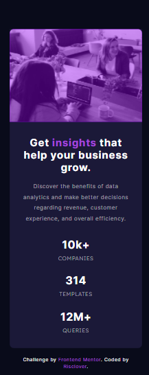

# Frontend Mentor - Stats preview card component solution

This is a solution to the [Stats preview card component challenge on Frontend Mentor](https://www.frontendmentor.io/challenges/stats-preview-card-component-8JqbgoU62). Frontend Mentor challenges help you improve your coding skills by building realistic projects. 

## Table of contents

- [Overview](#overview)
  - [The challenge](#the-challenge)
  - [Screenshot](#screenshot)
    - [Desktop](#desktop)
    - [Mobile](#mobile)
  - [Links](#links)
- [My process](#my-process)
  - [Built with](#built-with)
  - [What I learned](#what-i-learned)
    - [Layout](#layout)
    - [Making My Page Responsive](#making-my-page-responsive)
  - [Continued development](#continued-development)
  - [Useful resources](#useful-resources)
- [Author](#author)
- [Acknowledgments](#acknowledgments)


## Overview

### The challenge

Users should be able to:

- View the optimal layout depending on their device's screen size

### Screenshot

#### Desktop


#### Mobile



### Links

- [Solution URL](https://github.com/Risclover/stats-preview-card)
- [Live Site URL](https://risclover.github.io/stats-preview-card/)

## My process

### Built with

- Semantic HTML5 markup
- CSS custom properties
- Flexbox

### What I learned

#### Layout
I started out by turning the HTML into a layout that I thought could work. Since I'm getting pretty used to CSS Flexbox now, I was able to think about it for a moment and then execute it, which I'm happy about! Flexbox used to confuse me, but I think I've conquered it.

I looked at the challenge picture (of what the page should look like when finished) and decided to do the following within the body tags:

```html
<main>
<!-- Main container -->
<div id="main"> 

  <!-- Left side of main container -->
  <div id="left"> 

    <!-- Main text on upper left side -->
    <div id="maintext">
      <h1>
        Get <span class="highlight">insights</span> that help your business grow.
      </h1>

      <p>
        Discover the benefits of data analytics and make better decisions regarding revenue, customer 
        experience, and overall efficiency.
      </p>
    </div>

    <!-- Stats on lower left side -->
    <div id="stats">
      <div class="statsbox">
        <h2>10k+</h2> <p class="stathead">companies</p>
      </div>

      <div class="statsbox">
        <h2>314</h2> <p class="stathead">templates</p>
      </div>

      <div class="statsbox">
        <h2>12M+</h2> <p class="stathead">queries</p>
      </div>
    </div>

  </div>

  <!-- Right side of main container -->
  <div id="right">
    
  </div>
</div>
<!-- Footer credits -->
<div class="attribution">
  Challenge by <a href="https://www.frontendmentor.io?ref=challenge" target="_blank">Frontend Mentor</a>. 
  Coded by <a href="#">Risclover</a>.
</div>
</main>
```

#### Making My Page Responsive

I am extremely excited because I was able to make this website pretty much totally responsive. It was my first time using two media queries to do so, after figuring out that ~710px was the spot where I needed to make that sort of switch from mobile to desktop (through manual testing).

```css
@media screen and (min-width: 711px){

...

}
```

```css
@media screen and (max-width: 710px) {

...

}
```

The thing is, the challenge gives you a few parameters to use - for example, 15px for the main font. But I wasn't able to make my page fully responsive until I got rid of all of the px and made pretty much most of my units vw instead. Go look at my CSS code for yourself to see what I mean.


## Author

- Website - [Gaming with Risclover](https://gamingwithrisclover.wixsite.com/home/)
- Frontend Mentor - [@Risclover](https://www.frontendmentor.io/profile/Risclover)
